# Architecture — System Overview

> **Generated:** 2026-07-14 | **Source:** deterministic AST extraction from 69 Python files
> **View:** paste the Mermaid blocks into [mermaid.live](https://mermaid.live) or open in VS Code with a Mermaid preview extension

---

## TL;DR

The system is a **multi-agent typed-memory RAG chatbot**. One user turn flows through 12 phases:

```
User → Route → Persist → Retrieve → Rerank → Build Context
     → LangGraph (optional) → Legacy Context → Compare → Validate → Generate → Memory Update
```

Two storage backends: **SQLite** (chats, messages, structured memories, gists) and **Chroma** (document chunks, long-term memory vectors). All memory sources normalize into `MemoryCandidate`, all context assembles into `ContextPacket`.

---

## 1. System Component Map

```mermaid
graph TB
    subgraph Presentation["📱 Presentation"]
        chainlit["Chainlit UI<br/>app.py"]
        chat_service["ChatService<br/>chat_service.py"]
        data_layer["SQLiteChainlitDataLayer<br/>chainlit_data_layer.py"]
    end

    subgraph Agents["🧠 Agent Layer"]
        coordinator["CoordinatorAgent<br/>agents/coordinator_agent.py"]
        chat["ChatAgent<br/>agents/chat_agent.py"]
        doc_ingest["DocumentIngestionAgent<br/>agents/document_ingestion_agent.py"]
        stm_agent["ShortTermMemoryAgent<br/>agents/short_term_memory_agent.py"]
        ctx_builder_agent["ContextBuilderAgent<br/>agents/context_builder_agent.py"]
    end

    subgraph Routing["🔀 Routing"]
        routing_agent["RoutingAgent<br/>routing/routing_agent.py"]
        route_planner["RoutePlanner<br/>routing/route_planner.py"]
        query_analyzer["QueryAnalyzer<br/>routing/query_analyzer.py"]
        semantic["SemanticRouter<br/>routing/semantic_router.py"]
    end

    subgraph Retrieval["🔍 Retrieval"]
        dispatcher["RetrieverDispatcher<br/>retrieval/retriever_dispatcher.py"]
        recent["RecentMessages<br/>recent_messages_retriever.py"]
        struct_ret["StructuredMemory<br/>structured_memory_retriever.py"]
        doc_ret["LangChainChroma<br/>langchain_chroma_retriever.py"]
        gist["CurrentChatGist<br/>current_chat_gist_retriever.py"]
        span["CurrentChatSpan<br/>current_chat_span_retriever.py"]
        prev_gist["PreviousChatGist<br/>previous_chat_gist_retriever.py"]
        raw_span["RawMessageSpan<br/>raw_message_span_retriever.py"]
        expander["GistRawSpanExpander<br/>gist_raw_span_expander.py"]
    end

    subgraph Reranking["📊 Reranking"]
        reranker["MemoryReranker<br/>retrieval/reranker.py"]
        cross_enc["CrossEncoderBackend<br/>cross_encoder_reranker.py"]
    end

    subgraph ContextAssembly["📋 Context Assembly"]
        ctx_mgr["ContextManagerAgent<br/>agents/context_manager_agent.py"]
        budget_plan["DynamicBudgetPlanner<br/>context/dynamic_budget.py"]
        budget_alloc["ContextBudgetAllocator<br/>context/context_budget_allocator.py"]
        selector["EvidenceSelector<br/>context/evidence_selector.py"]
        builder["ContextBuilder<br/>context/context_builder.py"]
    end

    subgraph Validation["✅ Validation & Fallback"]
        comparator["ContextComparator<br/>context/context_comparator.py"]
        prompt_valid["PromptMessages<br/>context/prompt_messages.py"]
    end

    subgraph Orchestration["🔧 Orchestration"]
        demo["Demo Orchestration<br/>orchestration/demo_orchestration.py"]
        langgraph["LangGraph Pipeline<br/>orchestration/langgraph_memory_pipeline.py"]
    end

    subgraph MemorySystem["🧩 Memory System"]
        short_term["ShortTermMemory<br/>memory/short_term.py"]
        langmem["LangMemStructured<br/>memory/langmem_structured.py"]
        lt_store["LongTermMemoryStore<br/>memory/long_term_store.py"]
        lt_vector["VectorIndex<br/>memory/long_term_vector_index.py"]
        gist_sum["ChatGistSummarizer<br/>memory/chat_gist_summarizer.py"]
        prev_gist_gen["PreviousChatGistGen<br/>memory/previous_chat_gist.py"]
    end

    subgraph Storage["💾 Storage"]
        sqlite[("SQLite<br/>database.py<br/>9 tables")]
        chroma[("Chroma<br/>vector DB")]
        llm[("LLM Provider<br/>OpenAI-compatible")]
    end

    subgraph Lifecycle["🔄 Lifecycle"]
        end_chat["ChatEndAction<br/>actions/chat_end.py"]
        fork_chat["ChatForkAction<br/>actions/chat_fork.py"]
    end

    subgraph Contracts["📐 Core Contracts"]
        contracts["MemoryCandidate<br/>ContextPacket<br/>RoutePlan<br/>WorkflowTrace<br/>core/contracts.py"]
    end

    %% Edges — solid = direct import, dotted = data flow / delegation / sync

    %% Coordinator → agents
    coordinator --> routing_agent
    coordinator --> route_planner
    coordinator --> dispatcher
    coordinator --> reranker
    coordinator --> ctx_mgr
    coordinator --> ctx_builder_agent
    coordinator --> stm_agent
    coordinator --> chat
    coordinator --> builder
    coordinator --> budget_alloc
    coordinator --> contracts
    coordinator --> comparator
    coordinator --> prompt_valid

    %% Routing internal
    routing_agent --> route_planner
    route_planner --> query_analyzer
    routing_agent -.-> semantic

    %% Dispatcher → all retrievers + expander
    dispatcher --> recent
    dispatcher --> struct_ret
    dispatcher --> doc_ret
    dispatcher --> gist
    dispatcher --> span
    dispatcher --> prev_gist
    dispatcher --> raw_span
    dispatcher --> expander

    %% Reranker
    reranker --> cross_enc
    reranker --> contracts

    %% Context assembly
    ctx_mgr --> budget_plan
    ctx_mgr --> budget_alloc
    ctx_mgr --> selector
    ctx_mgr --> builder
    builder --> contracts

    %% Validation
    coordinator --> comparator
    coordinator --> prompt_valid

    %% Orchestration
    coordinator --> demo
    demo --> langgraph

    %% Memory system
    short_term --> langmem
    short_term --> lt_store
    langmem --> lt_store
    lt_store -.-> lt_vector
    stm_agent --> short_term

    %% Retrieval → storage
    struct_ret --> lt_store
    struct_ret --> lt_vector
    doc_ret --> chroma
    doc_ingest --> chroma

    %% Storage connections
    coordinator --> sqlite
    short_term --> sqlite
    lt_store --> sqlite
    lt_vector --> chroma
    prev_gist_gen --> sqlite
    gist_sum --> sqlite

    %% Answer generation (ModelWrapper is the actual API client)
    chat --> model_wrapper["ModelWrapper<br/>model_wrapper.py"]
    model_wrapper --> llm
    langmem --> llm

    %% Lifecycle
    coordinator --> end_chat
    end_chat --> prev_gist_gen
    end_chat --> short_term

    %% Chainlit & Presentation
    chainlit --> chat_service
    chainlit --> data_layer
    chat_service --> coordinator
    chat_service --> stm_agent
    data_layer --> sqlite

    %% Legend
    classDef container fill:#1a1a2e,stroke:#6c63ff,stroke-width:2px,color:#e0e0ff
    class sqlite,chroma,llm container
```



### Layer Import Rules (verified from AST extraction)

| Layer | Imports From |
|-------|-------------|
| **agents/** | context, core, documents, memory, orchestration, retrieval, routing |
| **routing/** | core |
| **retrieval/** | core, documents, memory |
| **context/** | core |
| **memory/** | context, core, retrieval |
| **orchestration/** | agents, core, retrieval, routing |
| **documents/** | retrieval |
| **actions/** | lifecycle, memory |
| **inspection/** | core |

Direction is top-down: agents → retrieval/context/routing → memory → core. `memory → retrieval` allows the structured memory retriever to query both SQLite and Chroma. `memory → context` is for token estimation during batch scheduling.

---

## 2. One-Turn Sequence

```mermaid
sequenceDiagram
    actor User
    participant Chainlit as Chainlit<br/>app.py
    participant CS as ChatService<br/>chat_service.py
    participant Coord as CoordinatorAgent<br/>coordinator_agent.py
    participant Route as RoutingAgent<br/>routing_agent.py
    participant Dispatch as RetrieverDispatcher<br/>retriever_dispatcher.py
    participant Retrievers as Source Retrievers
    participant Expander as GistRawSpanExpander
    participant Reranker as MemoryReranker<br/>reranker.py
    participant CtxMgr as ContextManagerAgent
    participant Selector as EvidenceSelector
    participant Builder as ContextBuilder
    participant LangGraph as LangGraph Pipeline
    participant STM_Agent as ShortTermMemoryAgent
    participant CtxBuilder as ContextBuilderAgent<br/>(legacy)
    participant Comparator as ContextComparator
    participant PromptValid as PromptMessages<br/>prompt_messages.py
    participant Chat as ChatAgent<br/>chat_agent.py
    participant Model as ModelWrapper<br/>model_wrapper.py
    participant STM as ShortTermMemory<br/>short_term.py
    participant LangMem as LangMemStructured<br/>langmem_structured.py
    participant LTStore as LongTermStore<br/>long_term_store.py
    participant DB as SQLite<br/>database.py
    participant Chroma as Chroma

    User->>Chainlit: sends message
    Chainlit->>CS: handle_user_turn(content)
    CS->>Coord: run_turn(chat_id, content)

    rect rgb(30,30,60)
        Note over Coord,Route: Phase 1 — Route
        Coord->>Route: route(content)
        Route->>Route: QueryAnalyzer.analyze()
        Route->>Route: RoutePlanner.plan()
        Route-->>Coord: RoutePlan (intent + source enables)
    end

    rect rgb(30,30,60)
        Note over Coord,DB: Phase 2 — Persist user message
        Coord->>DB: save_message(chat_id, "user", content)
    end

    rect rgb(30,30,60)
        Note over Coord,Chroma: Phase 3 — Retrieve (includes gist expansion)
        Coord->>Dispatch: retrieve(chat_id, route_plan)
        loop Each enabled source
            Dispatch->>Retrievers: retrieve(chat_id, source_plan)
            Retrievers->>DB: query messages/gists
            Retrievers->>Chroma: vector search
            Retrievers-->>Dispatch: MemoryCandidate[]
        end
        Dispatch->>Expander: expand(candidates)
        Expander->>DB: fetch raw spans for gist candidates
        Expander-->>Dispatch: expanded MemoryCandidate[]
        Dispatch-->>Coord: MemoryCandidate[]
    end

    rect rgb(30,30,60)
        Note over Coord,Reranker: Phase 4 — Rerank
        Coord->>Reranker: rank_with_trace(candidates, profile, query)
        Reranker->>Reranker: deterministic scoring (11 features)
        opt cross-encoder / LLM hybrid
            Reranker->>Reranker: semantic rescore / gated LLM reranking
        end
        Reranker-->>Coord: ranked MemoryCandidate[] + score_breakdown
    end

    rect rgb(30,30,60)
        Note over Coord,Builder: Phase 5 — Build Context Packet (new pipeline)
        Coord->>CtxMgr: build_context_packet(ranked, route_plan)
        CtxMgr->>CtxMgr: BudgetAllocator.allocate() → initial budget
        CtxMgr->>Selector: select() with INFINITE budget (preflight)
        Selector-->>CtxMgr: required evidence floor
        CtxMgr->>CtxMgr: DynamicBudgetPlanner.plan() with floor → working cap
        CtxMgr->>Selector: select() with actual working budget
        Selector->>Selector: required-evidence first → deduplicate → fold
        Selector->>Selector: marginal utility selection
        Selector-->>CtxMgr: selected candidates + satisfaction status
        CtxMgr->>Builder: build(prompt, candidates, budget)
        Builder->>Builder: group by source → budget fit → model messages
        Builder-->>CtxMgr: ContextPacket
        CtxMgr-->>Coord: ContextPacket + metadata
    end

    rect rgb(30,30,60)
        Note over Coord,LangGraph: Phase 6 — [Optional] LangGraph orchestration
        Coord->>LangGraph: run_read_only_langgraph_orchestration()
        LangGraph->>LangGraph: route → retrieve → expand → rerank → context → validate
        alt LANGGRAPH_DEMO: graph is authoritative
            LangGraph-->>Coord: authoritative ContextPacket
        else LANGGRAPH_SHADOW: comparison only
            LangGraph-->>Coord: comparison results
        else Error: fallback to native ContextPacket
        end
    end

    rect rgb(35,25,55)
        Note over Coord,CtxBuilder: Phase 7 — Build legacy context (for comparison)
        Coord->>STM_Agent: build_context(chat_id)
        STM_Agent->>STM: load recent messages + structured state
        STM-->>STM_Agent: ShortTermContext
        STM_Agent-->>Coord: short-term context
        Coord->>CtxBuilder: build(chat_id, prompt, context)
        CtxBuilder-->>Coord: legacy model_messages + ContextPacket
    end

    rect rgb(35,25,55)
        Note over Coord,Comparator: Phase 8 — Compare context pipelines
        Coord->>Comparator: compare(old=legacy, new=trace)
        Comparator->>Comparator: source overlap, candidate overlap, token diffs
        Comparator-->>Coord: ContextComparison + warnings
    end

    rect rgb(35,25,55)
        Note over Coord,PromptValid: Phase 9 — Validate & decide fallback
        Coord->>PromptValid: context_packet_to_model_messages(packet, user_msg)
        PromptValid->>PromptValid: system present? empty content? roles valid?
        PromptValid->>PromptValid: severe comparison warnings?
        PromptValid->>PromptValid: latest user message present exactly once and final?
        PromptValid-->>Coord: PromptAssemblyResult (valid + messages)
        alt Packet invalid: fallback to legacy
            Coord->>Coord: use legacy short-term memory messages
        else Packet valid: use trace pipeline messages
        end
    end

    rect rgb(30,30,60)
        Note over Coord,Model: Phase 10 — Generate answer
        Coord->>Chat: generate(final_model_messages)
        Chat->>Model: chat(messages)
        Model-->>Chat: answer string
        Chat-->>Coord: answer
    end

    rect rgb(30,30,60)
        Note over Coord,DB: Phase 11 — Persist assistant message
        Coord->>DB: save_message(chat_id, "assistant", answer)
        Coord-->>CS: AgentTurnResult
    end

    rect rgb(40,20,20)
        Note over CS,DB: Phase 11b — Persist answer inspection (ChatService scope)
        CS->>DB: persist_answer_inspection(result)
    end

    rect rgb(40,20,20)
        Note over Coord,LTStore: Phase 12 — Post-answer memory update (inline path)
        Coord->>STM_Agent: update_memory_if_needed(chat_id)
        STM_Agent->>STM: update_memory_if_needed(chat_id)
        STM->>STM: select pending un-summarized messages
        STM->>STM: form ConversationUnits (user/assistant pairs)
        STM->>LangMem: update(existing_memory, messages)
        LangMem->>LangMem: LLM extraction → normalize → validate
        LangMem->>LTStore: upsert(records)
        LTStore->>DB: write to SQLite (long_term_memories)
        LTStore->>Chroma: sync vectors (long_term_memory index)
        STM->>DB: mark messages as summarized
        STM-->>STM_Agent: MemoryUpdateResult
        STM_Agent-->>Coord: update complete
    end

    CS-->>Chainlit: answer + workflow trace
    Note over CS: deferred path (perform_memory_update=False):
    Note over CS: CS.finalize_post_answer_memory_update()
    Note over CS: → STM.update_memory_if_needed() directly
    Chainlit-->>User: displays answer
```



---

## 3. Data Flow Summary

### What Moves Between Phases

| Phase | Input | Output |
|-------|-------|--------|
| Route | user query string | `RoutePlan` (intent + source enables) |
| Retrieve | `RoutePlan` + `chat_id` | `MemoryCandidate[]` (retrieved + gist-expanded) |
| Rerank | `MemoryCandidate[]` + query + ranking profile | ranked `MemoryCandidate[]` + score breakdown |
| Build Context | ranked candidates + `RoutePlan` + system prompt + latest user message | `ContextPacket` (model-ready messages + token budget) |
| LangGraph | query + services | alternative `ContextPacket` (demo mode) or comparison (shadow mode) |
| Legacy Context | `chat_id` + prompt | legacy model_messages + ContextPacket |
| Compare | legacy messages + trace packet | `ContextComparison` (overlap, diffs, warnings) |
| Validate | `ContextPacket` + user message | `PromptAssemblyResult` (valid/invalid + final messages) |
| Generate | final model_messages | answer string |
| Memory Update | chat messages | structured memory records in SQLite + Chroma |

### Core Data Types (all in `src/core/contracts.py`)

| Type | Purpose |
|------|---------|
| `MemoryCandidate` | One retrieved memory item (source, content, score, provenance) |
| `ContextPacket` | Final assembled context (system prompt, candidates, model messages, budget) |
| `RoutePlan` | Which sources to query, intent, confidence, context profile |
| `WorkflowTrace` | Full turn trace (route, retrieved, ranked, budget, packet, errors) |
| `AgentTurnResult` | Final turn output (answer, trace, metadata) |

### Architecture Layers (top → down)

```
Presentation    chainlit (app.py, chainlit_data_layer.py, chat_service.py)
       │
Agents          CoordinatorAgent, ChatAgent, ShortTermMemoryAgent,
                ContextManagerAgent, ContextBuilderAgent, DocumentIngestionAgent
       │
Routing         RoutingAgent → RoutePlanner → QueryAnalyzer
                SemanticRouter (parallel, default-off)
       │
Retrieval       RetrieverDispatcher → 7 source retrievers → GistRawSpanExpander
       │
Reranking       MemoryReranker (deterministic / cross-encoder / LLM hybrid)
       │
Context         DynamicBudgetPlanner → BudgetAllocator → EvidenceSelector → ContextBuilder
       │
Validation      ContextComparator + PromptMessages (legacy vs new comparison + fallback gate)
       │
Orchestration   Demo orchestration modes + LangGraph read-only StateGraph pipeline
       │
Memory          ShortTermMemory → LangMemStructured → LongTermMemoryStore
                ↓ VectorSync → LongTermMemoryVectorIndex
       │
Documents       Loaders, splitters, registry, inspection
       │
Actions         ChatEndAction, ChatForkAction (lifecycle finalization)
       │
Inspection      Per-answer observability (answer_inspector.py)
       │
Storage         SQLite (9 tables) + Chroma (vector DB) + LLM Provider (via ModelWrapper)
```

### Memory Sources → Storage Mapping

| Source | Storage | Retriever |
|--------|---------|-----------|
| `recent_messages` | SQLite `messages` | `RecentMessagesRetriever` |
| `structured_memory` | SQLite `long_term_memories` + Chroma | `StructuredMemoryRetriever` |
| `document_memory` | Chroma | `LangChainChromaRetriever` |
| `current_chat_gist` | SQLite `chat_gists` | `CurrentChatGistRetriever` |
| `current_chat_span` | SQLite `messages` | `CurrentChatSpanRetriever` |
| `previous_chat_gist` | SQLite `chat_gists` | `PreviousChatGistRetriever` |
| `raw_message_span` | SQLite `messages` | `RawMessageSpanRetriever` |

### Orchestration Modes

| Mode | Behavior |
|------|----------|
| `native` (default) | CoordinatorAgent's imperative pipeline only |
| `langgraph_demo` | LangGraph StateGraph pipeline is authoritative; native is fallback |
| `compare` | Both run; native is authoritative; LangGraph is comparison-only |

### Fallback Chain

The system has a safety net: if the new trace-context pipeline produces an invalid
`PromptAssemblyResult` (e.g., missing latest user message, empty content), or if
`ContextComparator` detects severe warnings (e.g., `missing_latest_user_message`),
the answer automatically falls back to the legacy `ShortTermMemory` +
`ContextBuilderAgent` message path. This prevents context budgeting bugs and
pipeline misconfiguration from breaking user-visible answers.

---

## 6. Document Retrieval Pipeline (2026-07-17 Update)

### 6.1 Chunk Size Aligned to Embedding Model

The embedding model `all-MiniLM-L6-v2` caps input at 256 word-pieces and was
trained at 128 tokens. Chunk size is now 256 characters (was 1000), with 22%
overlap (56 characters). This ensures the model embeds full chunk content
without silent truncation.

Env vars: `LANGCHAIN_CHUNK_SIZE` (256), `LANGCHAIN_CHUNK_OVERLAP` (56).

### 6.2 Hybrid Retrieval (Semantic + Lexical)

`LangChainChromaRetriever.retrieve()` fetches 2× the requested limit from
Chroma, then blends 70% semantic similarity with 30% lexical overlap score via
`_hybrid_rerank()`. Lexical scoring catches exact string matches (e.g. "Problem
3") that embedding models encode weakly.

### 6.3 Neighbor Chunk Expansion

After top-k selection, ±1 neighboring chunks are fetched from Chroma and
appended. Not counted toward the retrieval limit. Marked with
`retrieval_mode: "neighbor_expansion"` in metadata.

### 6.4 Intent-Aware Top-K

`DOCUMENT_TOP_K` defaults to 40 (was 8), scaled 5× to match the ~4× smaller
chunks. Route planner `document_memory` source limit is 20. The dispatcher
boosts to 40 when `context_profile == "document_question"`.

### 6.5 Document Summarization at Ingestion

`DocumentIngestionAgent` generates a pre-computed document summary via LLM
after indexing. Stored in `document_records.summary_text` (SQLite, with
migration). For summary-like queries ("summarize", "contents", "overview"),
the retriever returns the pre-computed summary as a `MemoryCandidate` with
`skip_rerank: True` — the reranker preserves its original score (0.95).

Summary queries are detected via `SUMMARY_QUERY_TERMS` in
`langchain_chroma_retriever.py` and via expanded `document_terms` in
`QueryAnalyzerPolicy` ("contents", "overview", "what is in the document", etc.).

### 6.6 Document Scope Sticky Routing

When a chat has associated documents (in `chat_documents` table),
`document_memory` is always force-enabled in the route plan. A
`force_enabled_sources` parameter flows from `CoordinatorAgent.run_turn()`
through `run_read_only_langgraph_orchestration()` → LangGraph initial state →
`_route_node()`, which merges forced sources into the semantic router's output.
Controlled by `CHAT_DOCUMENT_SCOPE_STICKY` env var (default `"true"`).

New functions: `_chat_has_documents()`, `require_chat_document_memory()`,
`_merge_force_enabled_sources()`.

### 6.7 skip_rerank Mechanism

Candidates with `skip_rerank: True` metadata bypass the deterministic reranker,
preserving their original score. The reranker attaches required metadata
(`original_rank`, `reranker_candidate_id`, `score_breakdown`) to these
candidates so downstream trace builders never hit KeyErrors.

### 6.8 Retrieval Flow (Updated)

```
User query
  → RoutingAgent.route() includes sticky document scope check
  → RetrieverDispatcher.retrieve()
      → LangChainChromaRetriever.retrieve()
          → _try_summary_candidate() — pre-computed summary for summary queries
          → Chroma similarity_search (2× limit)
          → _hybrid_rerank() — 70% semantic + 30% lexical blend
          → _expand_neighbors() — ±1 context chunks
  → MemoryReranker.rank() — skip_rerank candidates preserve score
  → ContextManagerAgent → ContextPacket → LLM
```
