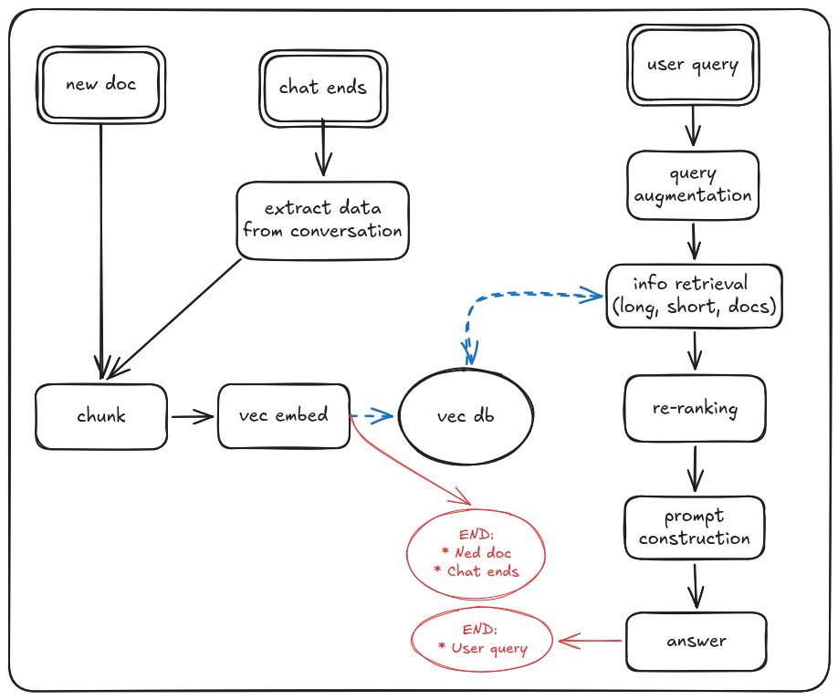
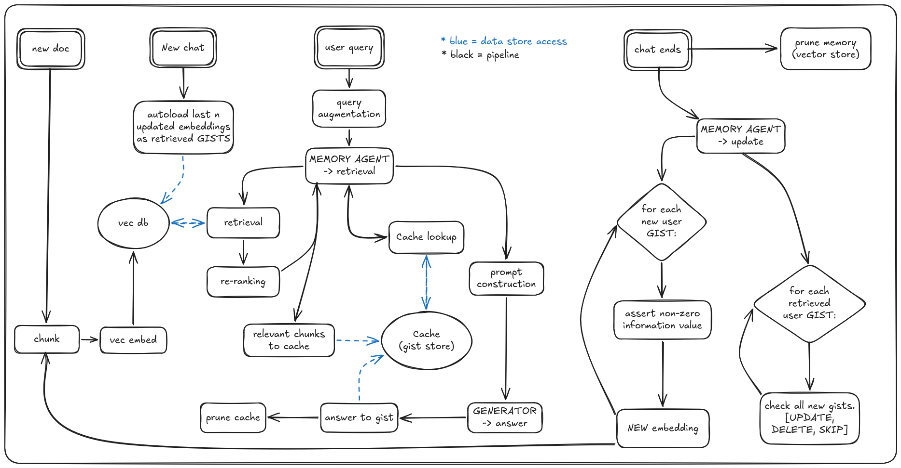
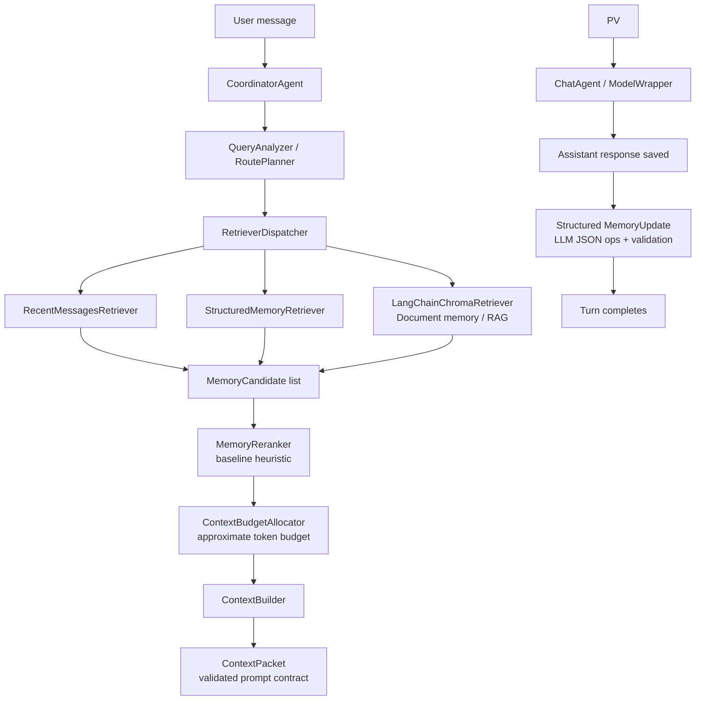

# Praktikum - memory retention chatbot (Josef & Keming)

## Section 1 - Diagrams:

#### Diagrams legend:

[Live Diagram](https://excalidraw.com/#room=4cd2a946aeff11c19667,dHc0y9ph7Lzl4F-leQ9AhA)

- Box - pipeline step
- Double Box - process begins
- Circle - Data store
- Black = pipeline
- Black dashed = optional parts
- Blue dashed = data flow
- Red = process termination

### Diagram 1:



### Diagram 1.5:


#### D-1 vs D-1.5 difference:

- D-1 inserts into vec-db once upon session termination
  -> bad UX - single expensive operation upon closing session
  -> early session termination => data loss
- D-1.5 inserts into vec-db after each question answer pair
  -> lower embedding quality
  -> smoother UX - compute distributed throughout the session
  -> safe against early termination

### Diagram 2:



## Section 2 - Current state of the codebase

The system is still linear, but agentic in workflow structure. It has separate modules for routing, retrieval, context construction, model call, and memory update.




we refactored the code to follow the agentic pipeline, but most components are still lightweight deterministic services rather than
autonomous agents. The architecture is in place, traceable, and test-covered, but retrieval/routing/ranking are still simple baselines.

| Step | Component | Role type | What it means |
|---:|---|---|---|
| 1 | `CoordinatorAgent` | **Orchestrator** | Main one-turn controller. Coordinates routing, retrieval, context construction, model call, and memory update. Still linear; could later become LangGraph if workflow becomes branchy. |
| 2 | `QueryAnalyzer` | **Decision module / baseline** | Detects query signals using simple rules/keywords. Provides the query-understanding stage, but is not yet semantic or LLM-based intent classification. |
| 3 | `RoutePlanner` | **Decision module / baseline** | Decides which memory sources to activate. The routing interface is useful, but the current policy is still simple. |
| 4 | `RetrieverDispatcher` | **Retrieval coordinator** | Dispatches retrieval to enabled memory sources and keeps the multi-source retrieval pipeline organized. |
| 5a | `RecentMessagesRetriever` | **Memory tool** | Retrieves recent raw conversation messages in chronological order. |
| 5b | `StructuredMemoryRetriever` | **Memory tool** | Retrieves structured current-chat memory records from SQLite. |
| 5c | `LangChainChromaRetriever` | **RAG tool / library-backed** | Uses LangChain-Chroma for document memory retrieval and converts retrieved documents into `MemoryCandidate`s. |
| 6 | `MemoryCandidate` | **Data contract** | Shared representation for retrieved context from recent messages, structured memory, and document RAG. |
| 7 | `MemoryReranker` | **Decision module / baseline** | Heuristic ranking of retrieved candidates. Future candidate for CrossEncoder, BGE, or rank-fusion reranking. |
| 8 | `ContextBudgetAllocator` | **Decision module / baseline** | Allocates approximate context budget. Later should use model-specific tokenizer-aware budgeting. |
| 9 | `ContextBuilder` | **Context assembly module** | Builds ordered context from selected memory candidates. |
| 10 | `ContextPacket` | **Data contract** | Explicit prompt/context package used for final model input. Helps make context construction traceable and validated. |
| 11 | `ChatAgent / ModelWrapper` | **Model interface** | Calls an OpenAI-compatible model endpoint. Local Ollama and larger cluster models can be configured. |
| 12 | `MemoryUpdate` | **State update module / baseline** | Extracts structured memory updates as JSON operations. Works, but currently synchronous and can add latency. |
| 13 | Turn completes | **Conceptual endpoint** | End of one linear turn. Not a real LangGraph `END` node yet. |
```

Implemented memory:

- recent raw messages
- structured current-chat memory
- basic rag document memory

Structured memory stores:

- user facts
- project facts
- decisions
- corrections
- open tasks
- preferences
- constraints

Not implemented yet:

- make baseline/decision module components agentic
- gists and more polished short-term-memory
- cross-chat long-term memory

Near-term:
1. Verify document chunks are fully incorporated into ContextPacket in the runtime path.
2. Add stronger standard RAG benchmarks: Natural Questions / HotpotQA.
3. Run model-answer evaluation with larger school-cluster models.
4. Run optional RAGAS scoring using exported rows.

Memory-focused next steps:
1. Add previous-chat / gist memory.
2. Add PerLTQA-style memory evaluation:
   - memory source classification
   - memory retrieval Recall@K
   - memory synthesis / answer quality
3. Evaluate old-chat multi-thread memory.

## Example images:


