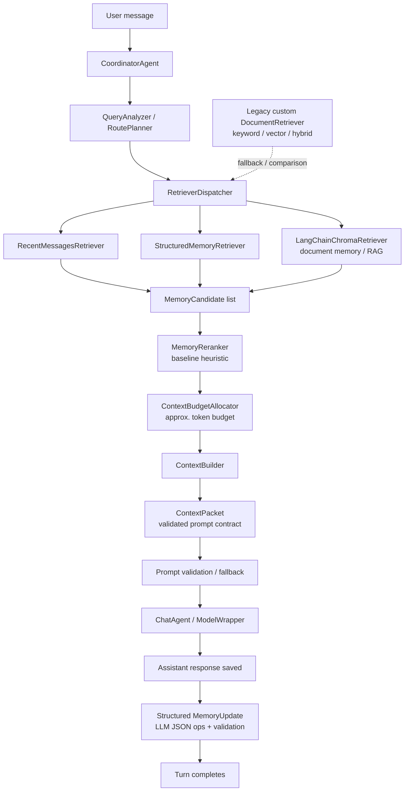

# Praktikum - memory retention chatbot (Josef & Keming)

## Section 1 - Diagrams:

#### Diagrams legend:

[Live Diagram](https://excalidraw.com/#room=4cd2a946aeff11c19667,dHc0y9ph7Lzl4F-leQ9AhA)

- Box - pipeline step
- Double Box - process begins
- Circle - Data store
- Black = pipeline
- Black dashed = optional parts
- Blue dashed = data flow
- Red = process termination

### Diagram 1:

### Diagram 1.5:

#### D-1 vs D-1.5 difference:

- D-1 inserts into vec-db once upon session termination
  -> bad UX - single expensive operation upon closing session
  -> early session termination => data loss
- D-1.5 inserts into vec-db after each question answer pair
  -> lower embedding quality
  -> smoother UX - compute distributed throughout the session
  -> safe against early termination

### Diagram 2:

## Section 2 - Current state of the codebase

we refactored the code to follow the agentic pipeline, but most components are still lightweight deterministic services rather than
autonomous agents. The architecture is in place, traceable, and test-covered, but retrieval/routing/ranking are still simple baselines.

| Stage         | Status                   | Notes                                                                                                            |
| ------------- | ------------------------ | ---------------------------------------------------------------------------------------------------------------- |
| User          | Working                  | Chainlit sends user messages into `ChatService`.                                                                 |
| Coordinator   | Working                  | `CoordinatorAgent` orchestrates the turn and records trace.                                                      |
| Router        | Baseline / working       | `QueryAnalyzer` + `RoutePlanner` use simple lexical rules; useful for routing shape and future sources.          |
| Retriever     | Working, limited sources | Retrieves active sources: recent messages and structured memory. Future retrievers are stubs.                    |
| Reranker      | Baseline / working       | Scores candidates and records breakdowns. More meaningful once chunks/docs/gists exist.                          |
| Budget        | Baseline / working       | Allocates approximate token budget by profile; currently low pressure with only two sources.                     |
| ContextPacket | Working                  | Default final prompt path. Handles structured memory, chronological recent messages, and latest user once.       |
| LLM           | Working, slow locally    | Uses `ModelWrapper` with OpenAI-compatible endpoint, currently `qwen2.5:3b` via Ollama. Main latency bottleneck. |
| MemoryUpdate  | Working                  | Extracts structured memory from older messages. Currently synchronous and may add latency when triggered.        |
| END           | Working                  | Trace records `termination_reason=response_generated_and_messages_saved`.                                        |

Implemented memory:

- recent raw messages
- structured current-chat memory

Structured memory stores:

- user facts
- project facts
- decisions
- corrections
- open tasks
- preferences
- constraints

Not implemented yet:

- gists
- chunks
- document memory
- embeddings
- vector DB
- cross-chat long-term memory

next steps

1. Add document ingestion:
   upload → parse → chunk → metadata.

2. Add embeddings/sqlite-vec:
   memory_items + vectors.

3. Add current-chat gist/chunk memory:
   older chat turns become source-grounded retrievable memory items.

## Example images:

