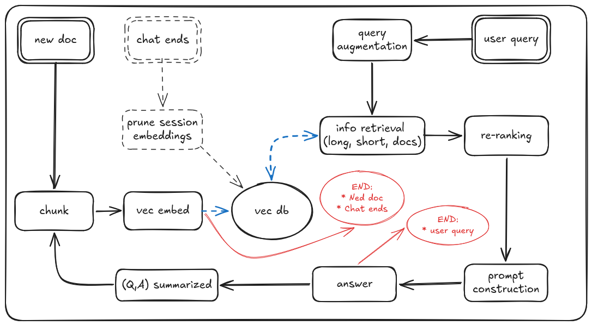

# Praktikum - memory retention chatbot (Josef & Keming)

## Section 1 - Theoretical vs Real diagrams:

#### Diagrams legend:

[Live Diagram](https://excalidraw.com/#room=4cd2a946aeff11c19667,dHc0y9ph7Lzl4F-leQ9AhA)

- Box - pipeline step
- Double Box - process begins
- Circle - Data store
- Black = pipeline
- Black dashed = optional parts
- Blue dashed = data flow
- Red = process termination

### Theoretical diagram (from last session)

### Diagram of real implementation (so far)

## Section 2 - Explanation of data set and testing methodology

- Examples of current implementation,
- If we have any issues we have been stuck on or any good examples we should include them
